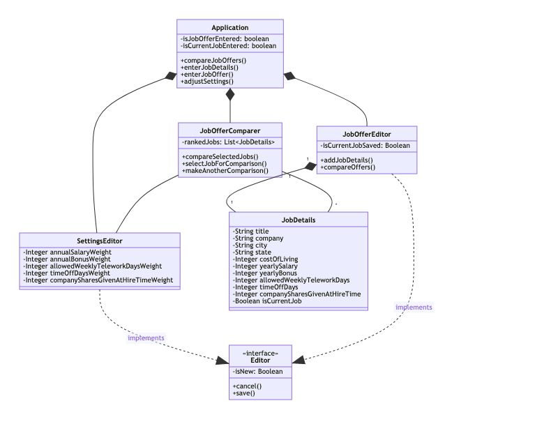

# Design Discussion 

## Design 1 - clee784

### Comments 

* Nice work!
* I feel like some of the things you represented in the class diagram are UI-specific. For example, does CurrentJob need to have an Edit function? Or simply an Edit button that exposes a UI? The same could be said of several other functions I think: SelectMenu, ReturnMainMenu, ComparisonSettings:Edit(), and perhaps others. There may be more than one way to resolve this, but I think that some of the classes themselves represent the UI they are showing instead of the a Class that needs to be represented.
* I decided that, because it seemed like perhaps Job Offers and Jobs have the same data (you seem to have arrived at the same conclusion) -- that I would represent them as one class. The UI itself would distinguish between them. Your proposal is reasonable though. This may be a question of style, in my opinion.
* If you do have the CurrentJob separated as its own class, then perhaps it should not be a list but a single JobDetails. This is suggested by the requirement to add or edit current job details -- but not to add new current jobs or delete them.
* Regarding requirements 7 and 8, I do think we should have a comment indicating that these are not in the scope of our class diagram but will be addressed later in the design process.
* I think that in the class UML diagram, the term interface refers to its meaning in the object-oriented programming sense, as in function definitions that need to be implemented by concrete classes. That is not the relationship between CompareJobOffer and ComparisonSettingsInterface, so I don't think this should be called an interface here. 
* I like your design, It’s is detailed and captures almost every requirement. But I am wondering if we need a separate interface for  every weighted setting.
* The current job shouldn’t be a list , it should be a single job per user

## Design 2 - npendley3

### Comments

* I think it is kind of strange to separate the ScoreWeightingAlogrithm as its own class -- but, in the lecture videos, our professor had a SchedulingAlgorithm, with no attributes, set up as a separate Class. So I decided to put this in separately. In my opinion, it would be reasonable to reduce this Class down to a single function of the Application.
* My UML is quite simple -- it's possible I over-simplified but I felt like I was creating classes just to represent UI features if I went further.
* Your design is really nice and simple. I think a few classes make the design simple and easy to understand. However, when we start actually implementing these classes, It will be very complicated. I'm not sure which is the right thing to do when it comes to design and implementation, having multiple small classes or one or a few giant ones. 
* It’s a nice design ...I think you aggregate some of the modulus, I believe they almost did the design, when I go through the requirements it’s as  if they separated the application into 4 classes (Modules) and they wanted us to implement that. Of Course we can have the freedom to change it.     

## Design 3 - Petros

### Comments 

* Nice work . I really like the boolean attribute “isCurrentJob” in the JobDetails classe. I never thought about identifying which job is the current job. We can easily identify which job is current and make the comparison. 
Good job.
* I believe that you have also captured the requirements nicely
* I see that you also used the boolean to indicate the current job -- I think this is a nice solution that allows us to use a common data structure and table for these details.  As you saw, I had in mind to only have one class to represent these two (you have a very “thin” class with no properties in the form of the Job Offer Editor.  I think that this is okay, though it may make more sense as a function of the GUI than an actual requirement to have a separate class.
* Similarly, I think the Editor class seems like it’s more for the GUI than anything else -- I feel like the Settings class would be sufficient.
* Do we need to persist more than one set of settings in the database?  I would think this would be one to one, not one to many.

## Team Design

* While, we can begin with anyone’s design and modify it based on our feedbacks,  we began with design 3 and modify it based on the feedbacks, there are several classes that need to be consolidated in Chinu’s design (or perhaps Petro’s layout is a happy medium between Chinu’s very granular and Nick's course design).  
* From Petros’s design we modified  main menu to be  aggregated into application class and jobdetails editing to be included in joboffer editor class.
* We discussed and modified relationships between modules.

## Summary

We learned from the individual design about different approaches and perspectives for same problem. During our discussion we narrowed down our differences and came up with a team design.