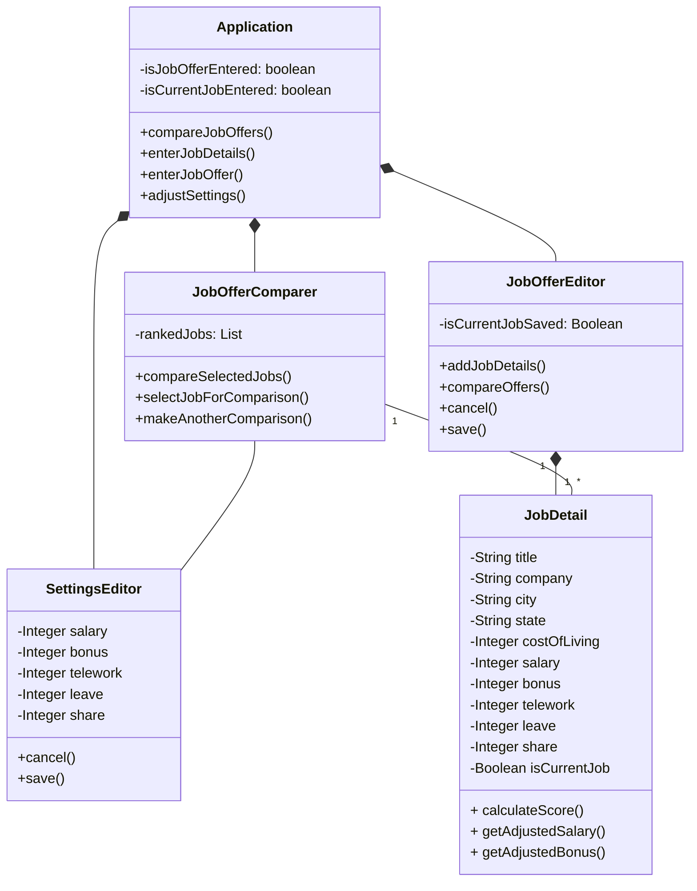

```mermaid
classDiagram
   Application *--  SettingsEditor
   Application *-- JobOfferComparer
   Application *-- JobOfferEditor
   JobOfferEditor "1" *-- "1" JobDetail
   JobOfferComparer "1" -- "*" JobDetail
   JobOfferComparer -- SettingsEditor
 
   class Application{
       -isJobOfferEntered: boolean
       -isCurrentJobEntered: boolean
       +compareJobOffers()
       +enterJobDetails()
       +enterJobOffer()
       +adjustSettings()
   }
 
   class SettingsEditor {
       -Integer salary
       -Integer bonus
       -Integer telework
       -Integer leave
       -Integer share
       +cancel()
       +save()       
    
   }
 
   class JobDetail{
       -String title
       -String company
       -String city
       -String state       
       -Integer costOfLiving
       -Integer salary
       -Integer bonus
       -Integer telework
       -Integer leave
       -Integer share       
       -Boolean isCurrentJob
       + calculateScore()
       + getAdjustedSalary()
       + getAdjustedBonus()
   }
 
   class JobOfferComparer{
       -rankedJobs: List<JobDetail>
       +compareSelectedJobs()
       +selectJobForComparison()
       +makeAnotherComparison()
   }
 
   class JobOfferEditor{
       -isCurrentJobSaved: Boolean
       +addJobDetails()
       +compareOffers()
       +cancel()
       +save()       
   }
```