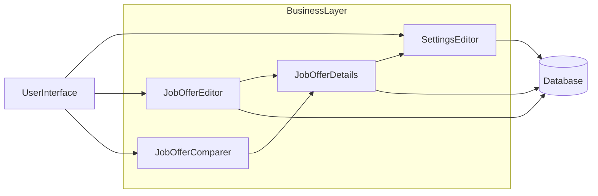

```mermaid

graph LR

    UserInterface --> SettingsEditor
    UserInterface --> JobOfferEditor
    UserInterface --> JobOfferComparer
    db[(Database)]

    subgraph BusinessLayer
        SettingsEditor 
        JobOfferEditor --> JobOfferDetails
        JobOfferDetails --> SettingsEditor
        JobOfferComparer --> JobOfferDetails
    end

    SettingsEditor --> db
    JobOfferEditor --> db
    JobOfferDetails --> db
```
