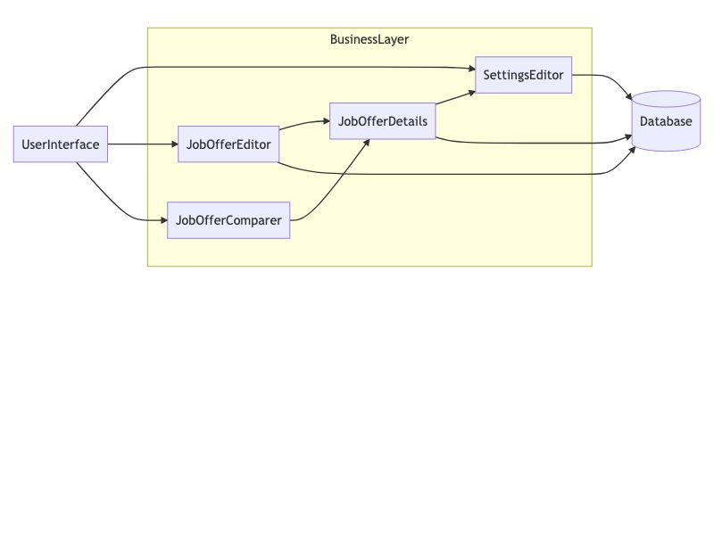
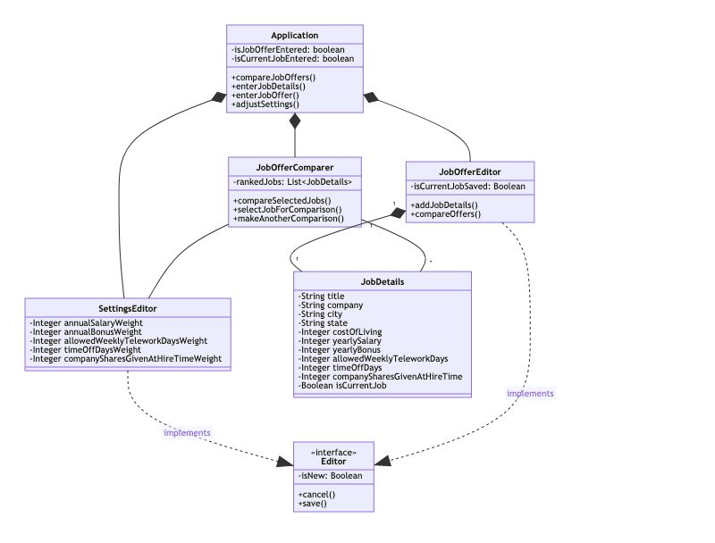
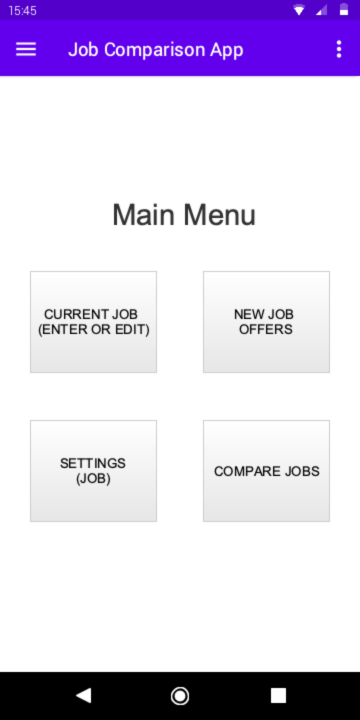
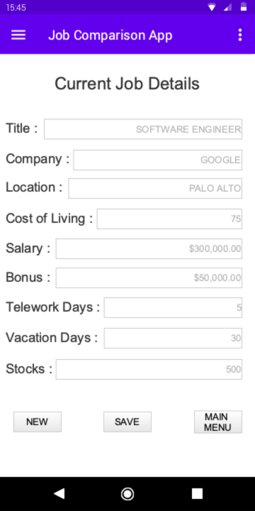
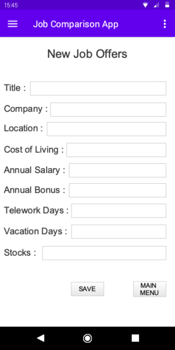
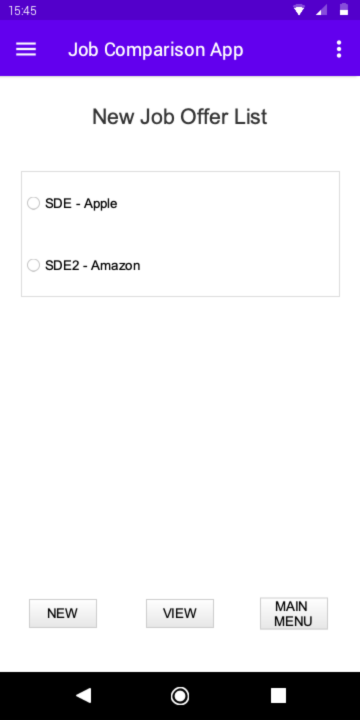
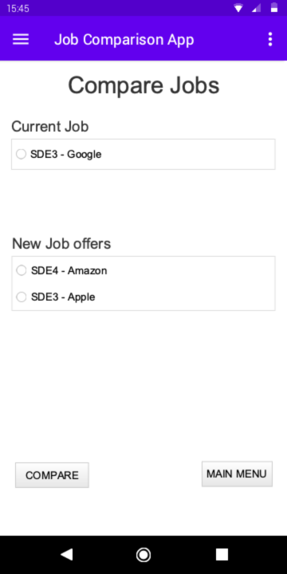
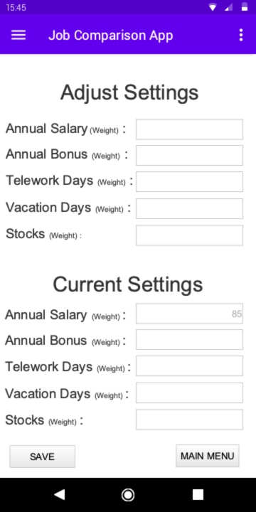
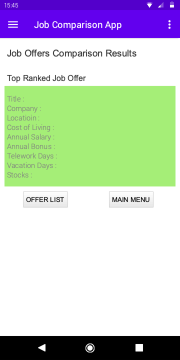

# Design Document

**Author**: Team 1

## 1 Design Considerations

### 1.1 Assumptions

We assume that the user is able to see, literate in English, and able to operate a touch-screen device. 

### 1.2 Constraints

No known constraints

### 1.3 System Environment

User will be running an Android device with a minimum Android version of 9.0 (Pie) and API version of 28.

## 2 Architectural Design

### 2.1 Component Diagram

The system is designed in three primary layers, with the user interface communicating with a business later which connect to the database.

### 2.2 Deployment Diagram

This application will be installed as an application on an Android device.  It will connect to no external services 

## 3 Low-Level Design

### 3.1 Class Diagram

This diagram presents the various classes and their relationships.

### 3.2 Other Diagrams

N/A

## 4 User Interface Design

.png)

