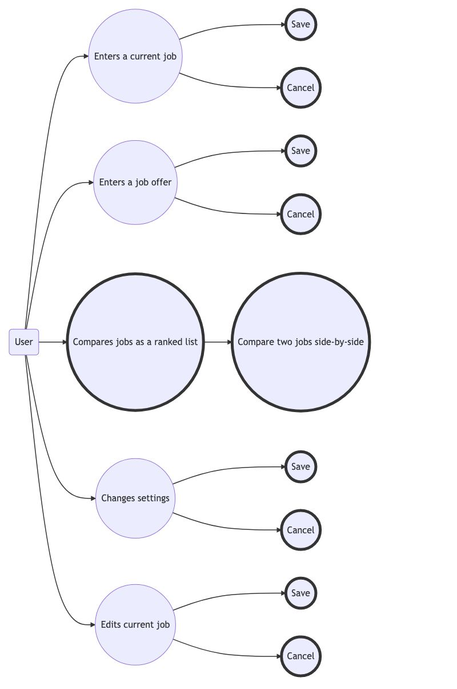

# Use Case Model

**Author**: Team-001

## 1 Use Case Diagram

## 2 Use Case Descriptions

### 1. Enter a current job

#### Requirements

The user must be able to enter all of the details about their current job into the application.  They must have the ability to save the data so that it persists upon a future run of the application.  The user must also be able to cancel the data entry so that it is not saved.

#### Preconditions

In order to save details about their job, they must have the necessary details about the job.

#### Postconditions

If the user enters data about a job and chooses to save, the data will be stored in the database and available for access in the application, for job comparison, ranking, etc.

#### Scenarios 

The user will select a button to enter a current job.  At that point they may enter job details and click a button to save or a button to cancel.

### 2. Enter a job offer

#### Requirements

The user must be able to enter information about a job offer into the application.  They must have the ability to save the data so that it persists upon a future run of the application.  The user must also be able to cancel the data entry so that it is not saved

#### Preconditions

In order to save details about their job, they must have the necessary details about the job offer.

#### Postconditions

If the user enters data about a job offer and chooses to save, the data will be stored in the database and available for access in the application, for job comparison, ranking, etc.

#### Scenarios 

The user will select a button to enter a job offer.  At that point they may enter job offer details and click a button to save or a button to cancel.

### 3. Compare two jobs

#### Requirements

The user must be able to compare a current job and any job offers, or compare two job offers in the system.

#### Preconditions

In order to compare two jobs, there must be a current job and at least one job offer, or there must be at least two job offers.  The user must choose two jobs from the ranked list of jobs.

#### Postconditions

The user will have seen the details about both jobs side-by-side.

### 4. Change settings

#### Requirements

A user must be able to assign weights to the job attributes used in the ranking algorithm.

#### Preconditions

The user must have weights which they wish to use for the ranking algorithm.

#### Postconditions

The user's weights will be persisted to the database and used for future job rankings.

### 5. Edit current job

#### Requirements

The user must be able to edit their current job.

#### Preconditions

The user must have an existing current job and changes they wish to make to the job details.

#### Postconditions

The changes to the current job will be persisted to the database and used for future job rankings and comparisons.
