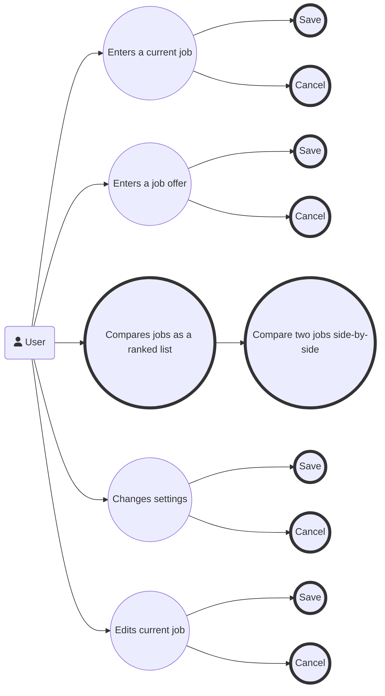

```mermaid
graph LR
    A("fa:fa-user User")


    A-->B((Enters a current job))
    B-->C((Save))
    B-->D((Cancel))
    style C stroke:#333,stroke-width:5px
    style D stroke:#333,stroke-width:5px

    A-->B2((Enters a job offer))
    B2-->C2((Save))
    B2-->D2((Cancel))
    style C2 stroke:#333,stroke-width:5px
    style D2 stroke:#333,stroke-width:5px    

    A-->B3((Compares jobs as a ranked list))
    style B3 stroke:#333,stroke-width:5px        

    B3-->B4((Compare two jobs side-by-side))
    style B4 stroke:#333,stroke-width:5px    

    A-->B5((Changes settings))
    B5-->C5((Save))
    B5-->D5((Cancel))
    style C5 stroke:#333,stroke-width:5px
    style D5 stroke:#333,stroke-width:5px    


    A-->B6((Edits current job))
    B6-->C6((Save))
    B6-->D6((Cancel))
    style C6 stroke:#333,stroke-width:5px
    style D6 stroke:#333,stroke-width:5px    

```